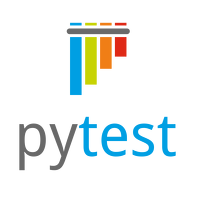

# Дипломный проект QA.GURU

## Автотесты на Python по проекту Niffler


<details>
<summary>Схема проекта Niffler 2.0 и используемые им технологии</summary>


- [Spring Authorization Server](https://spring.io/projects/spring-authorization-server)
- [Spring OAuth 2.0 Resource Server](https://docs.spring.io/spring-security/reference/servlet/oauth2/resource-server/index.html)
- [Spring data JPA](https://spring.io/projects/spring-data-jpa)
- [Spring Web](https://docs.spring.io/spring-framework/docs/current/reference/html/web.html#spring-web)
- [Spring actuator](https://docs.spring.io/spring-boot/docs/current/reference/html/actuator.html)
- [Spring gRPC by https://github.com/yidongnan](https://yidongnan.github.io/grpc-spring-boot-starter/en/server/getting-started.html)
- [Spring web-services](https://docs.spring.io/spring-ws/docs/current/reference/html/)
- [Apache Kafka](https://developer.confluent.io/quickstart/kafka-docker/)
- [Docker](https://www.docker.com/resources/what-container/)
- [Docker-compose](https://docs.docker.com/compose/)
- [Postgres](https://www.postgresql.org/about/)
- [React](https://ru.reactjs.org/docs/getting-started.html)
- [GraphQL](https://graphql.org/)
- [Thymeleaf](https://www.thymeleaf.org/)
- [Jakarta Bean Validation](https://beanvalidation.org/)
- [Jakarta JAXB](https://eclipse-ee4j.github.io/jaxb-ri/)
- [JUnit 5 (Extensions, Resolvers, etc)](https://junit.org/junit5/docs/current/user-guide/)
- [Retrofit 2](https://square.github.io/retrofit/)
- [Allure](https://docs.qameta.io/allure/)
- [Selenide](https://selenide.org/)
- [Selenoid & Selenoid-UI](https://aerokube.com/selenoid/latest/)
- [Allure-docker-service](https://github.com/fescobar/allure-docker-service)
- [Java 21](https://adoptium.net/en-GB/temurin/releases/)
- [Gradle 8.6](https://docs.gradle.org/8.6/release-notes.html)
- [GHA](https://docs.github.com/en/actions)
</details>

### Необходимые предусловия для локального запуска проекта Niffler

<details>
  <summary>Установить ПО на локальный хост</summary>
    
#### Если у вас ОС Windows

Необходимо использовать [bash terminal](https://www.geeksforgeeks.org/working-on-git-bash/), а
не powershell.
Обязательно добавьте bash терминал в [качестве терминала в вашей IDE (IDEA, PyCharm)](https://stackoverflow.com/questions/20573213/embed-git-bash-in-pycharm-as-external-tool-and-work-with-it-in-pycharm-window-w)

#### 1. Установить docker

#### 2. Установить Java версии 21. Это необходимо, т.к. проект использует синтаксис Java 21

Версию установленной Java необходимо проверить командой `java -version`

#### 3. Установить пакетный менеджер для сборки front-end npm
Рекомендованная версия Node.js - 22.6.0

</details>

<details>
  <summary>Запуск Niffler в докере</summary>

#### 1. Создать бесплатную учетную запись на https://hub.docker.com/ (если отсутствует)

#### 2. Создать в настройках своей учетной записи access_token

[Инструкция](https://docs.docker.com/docker-hub/access-tokens/).

#### 3. Выполнить docker login с созданным access_token (в инструкции это описано)

#### 4. Прописать в etc/hosts элиас для Docker-имени

- frontend:  127.0.0.1 frontend.niffler.dc,
- auth:      127.0.0.1 auth.niffler.dc
- gateway:   127.0.0.1 gateway.niffler.dc

```posh
User-MacBook-Pro niffler % vi /etc/hosts
```

```posh
##
# Host Database
#
# localhost is used to configure the loopback interface
# when the system is booting.  Do not change this entry.
##
127.0.0.1       localhost
127.0.0.1       frontend.niffler.dc
127.0.0.1       auth.niffler.dc
127.0.0.1       gateway.niffler.dc
```


Текущая версия `docker-compose-dev.sh` **удалит все запущенные Docker контейнеры в системе**, поэтому если у вас есть
созданные
контейнеры для других проектов - отредактируйте строку ```posh docker rm $(docker ps -a -q)```, чтобы включить в grep
только те контейнеры, что непосредственно относятся к niffler.

Фронтенд Niffler при запуске в докере будет работать для вас по адресу http://frontend.niffler.dc,
OpenAPI (Swagger) сервиса niffler-gateway доступен по адресу: http://gateway.niffler.dc:8090/swagger-ui/index.html
GraphiQL интерфейс сервиса niffler-gateway доступен по адресу: http://gateway.niffler.dc:8090/graphiql
WSDL сервиса niffler-userdata доступен по адресу: http://localhost:8089/ws/userdata.wsdl

Если при выполнении скрипта `docker-compose-dev.sh` вы получили ошибку:

```
* What went wrong:
Execution failed for task ':niffler-auth:jibDockerBuild'.
> com.google.cloud.tools.jib.plugins.common.BuildStepsExecutionException: 
Build to Docker daemon failed, perhaps you should make sure your credentials for 'registry-1.docker.io...
```

То необходимо убедиться, что в `$USER/.docker/config.json` файле отсутствует запись `"credsStore": "desktop"`
При наличии такого ключа в json, его надо удалить.
Если файл пустой, то возможно не выполнен `docker login`. Если выполнялся, то надо создать файл руками по пути
`$USER/.docker/config.json`
с содержимым,

```
 {
        "auths": {
                "https://index.docker.io/v1/": {}
        },
        "currentContext": "desktop-linux"
}
```

Если вы не можете подключиться к БД в docker, указывая верные login и password, то возможно у вас поднята другая база на
том же порту 5432.
Это известная проблема, что Postgres в docker может стартануть при зянятом порту 5432, надо убедиться что у вас не
поднят никакой другой Postgres на этом порту.

</details>

###  Используемые технологии
<p align="center">
  <code></code>
  <code></code>
  <code></code>
  <code></code>
  <code></code>
  <code></code>
  <code></code>
</p>

## Покрываемый функционал проекта Niffler
* UI тесты
    * ✅ Проверка функционала трат (9 тест кейсов)
    * ✅ Проверка функционала категорий (6 тест кейсов)
    * ✅ Проверка функционала поиска (10 тест кейсов)
    * ✅ Авторизации и регистрации пользователя (9 тест кейсов)


* API тесты
  * ✅ Проверка функционала трат (10 тест кейсов)
  * ✅ Проверка функционала категорий (8 тест кейсов)
  * ✅ Проверка функционала поиска (10 тест кейсов)
  * ✅ Авторизации и регистрации пользователя (9 тест кейсов)


* SOAP тесты
  * ✅ Проверка функционала друзей (8 тест кейсов)


* KAFKA тесты
  * ✅ Проверка функционала сервиса регистрации (2 тест кейса)


* gRPC тесты
  * ✅ Проверка функционала сервиса валюты (11 тест кейсов)

## Как запустить

## Локально, на хосте

Перед выполнением необходимо:
* Создать файл .env в директории python_test и определить в нем параметры конфигурации (пример в .env.sample):
    - FRONTEND_URL
    - GATEWAY_URL
    - AUTH_URL
    - AUTH_SECRET
    - SPEND_DB_URL
    - USERDATA_DB_URL
    - TEST_USERNAME
    - TEST_PASSWORD
    - KAFKA_ADDRESS
    - SOAP_ADDRESS
    - GRPC_HOST

```
Перейти в каталог python_test:
cd python_test
```


#### Запуск с последовательным выполнением
```
В консоли выполнить команду:
pytest --alluredir=[your_path_for_report] --clean-alluredir ./test
```

#### Некоторые тестовые модули возможно выполнить с поддержкой параллельного запуска:

- API тесты
- Авторизации и регистрации пользователя (UI)
- SOAP
- GRPC
```
В консоли выполнить команду:
pytest -n 4 --dist=worksteal --alluredir=[your_path_for_report] .\test -m parallel

```
  
, где [your_path_for_report] - путь до папки с отчетом о прогоне


## Удаленный запуск, через реализованный CI/CD Github Actions 
 Workflow запускается для событий Pull Request (создания, добавление коммита в ветку PR, и переоткрытия PR)

По результату автоматическоего прогона формируются allure отчеты с историей, с хранением в [Github Pages текущего репозитория](https://shade1471.github.io/niffler-py-st3/)

#### Allure отчет в Github Pages:


#### Структура тестового набора:


---

## Контакты для обратной связи:

- Email: a.gribanov@staffcop.ru
- Telegram: https://t.me/gribanov87